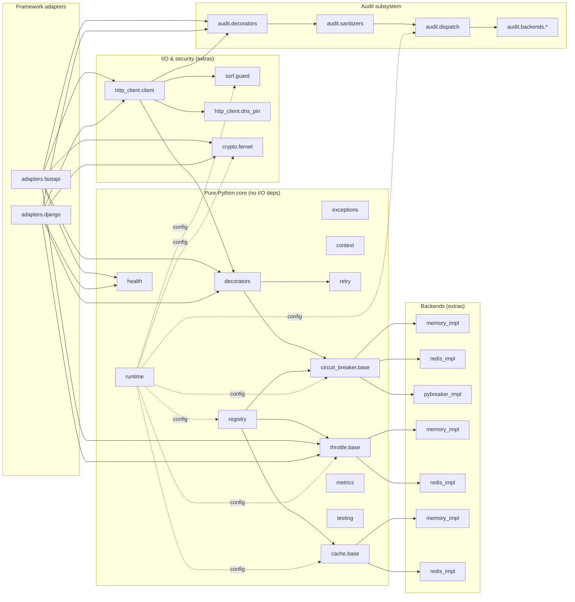
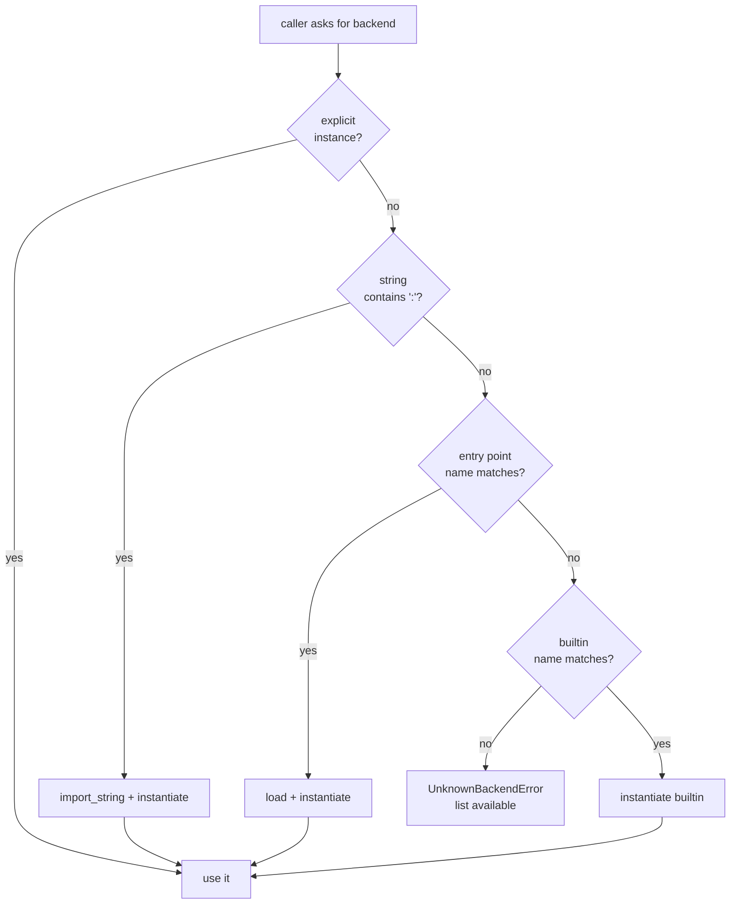
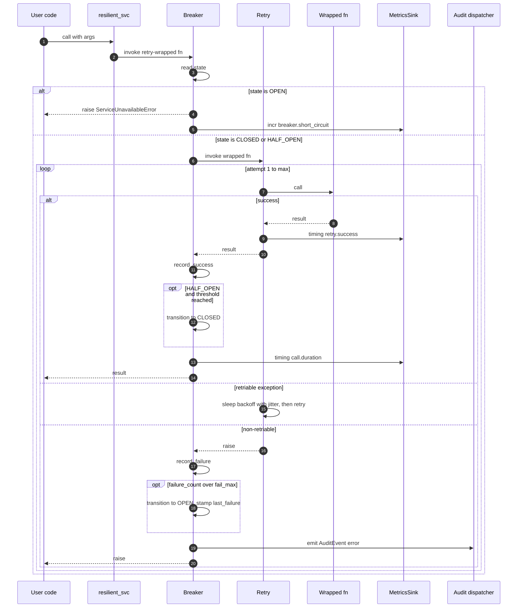
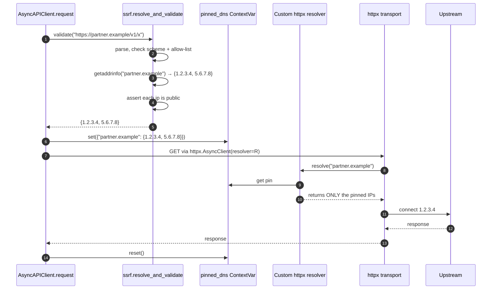
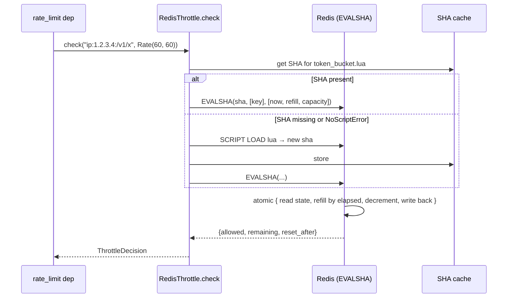
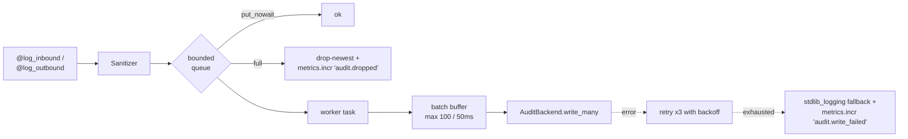

# Low-Level Design — `resilience-kit` v0.1

Complements [PRD.md](./PRD.md) (what & why) and [ROADMAP.md](./ROADMAP.md) (when). This document fixes the **internal contracts**: protocols, data shapes, sequence flows, concurrency model, and the settings schema. Directory layout lives in [DIRECTORY-TREE.md](./DIRECTORY-TREE.md).

---

## 1. Module boundaries



**Layering rule.** A lower-numbered layer never imports a higher-numbered one. Adapters never define primitives — they wire kit primitives into framework lifecycles.

| Layer | Modules | May import |
|---|---|---|
| L0 | `exceptions`, `runtime`, `context`, `utils` | stdlib only |
| L1 | `registry`, `retry`, `*/base.py`, `metrics`, `health`, `testing` | L0 |
| L2 | `*/memory_impl.py`, `decorators`, `recovery`, `dispatch`, `tasks`, `middleware` | L0–L1 |
| L3 | `*/redis_impl.py`, `*/pybreaker_impl.py`, `crypto`, `ssrf`, `http_client`, `audit/*` | L0–L2 |
| L4 | `adapters/django`, `adapters/fastapi` | L0–L3 |

Enforced by an `import-linter` config in CI.

---

## 2. Core protocols

All swappable subsystems are `typing.Protocol` types. Concrete impls are duck-typed; no inheritance required.

```python
# resilience_kit/circuit_breaker/base.py
class BreakerState(str, Enum):
    CLOSED = "closed"
    OPEN = "open"
    HALF_OPEN = "half_open"

@dataclass(frozen=True, slots=True)
class BreakerConfig:
    fail_max: int = 5
    reset_timeout: float = 30.0            # seconds
    success_threshold: int = 2
    excluded_exceptions: tuple[type[BaseException], ...] = ()

@dataclass(frozen=True, slots=True)
class HealthSnapshot:
    healthy: bool
    backend: str                            # "memory" / "redis" / ...
    degraded_since: float | None = None     # monotonic
    detail: str | None = None

class AsyncBreaker(Protocol):
    name: str
    config: BreakerConfig

    async def call(self, func: Callable[..., Awaitable[T]], /, *args, **kwargs) -> T: ...
    async def state(self) -> BreakerState: ...
    async def reset(self) -> None: ...
    async def health_check(self) -> HealthSnapshot: ...


# resilience_kit/throttle/base.py
@dataclass(frozen=True, slots=True)
class Rate:
    count: int
    per_seconds: float
    @classmethod
    def parse(cls, spec: str) -> "Rate": ...   # "60/min" → Rate(60, 60.0)

@dataclass(frozen=True, slots=True)
class ThrottleDecision:
    allowed: bool
    remaining: int
    reset_after: float                          # seconds until next slot
    limit: int

class AsyncThrottle(Protocol):
    async def check(self, key: str, rate: Rate) -> ThrottleDecision: ...
    async def reset(self, key: str) -> None: ...
    async def health_check(self) -> HealthSnapshot: ...


# resilience_kit/cache/base.py
class AsyncCache(Protocol):
    async def get(self, key: str) -> Any | None: ...
    async def set(self, key: str, value: Any, ttl: int | None = None) -> None: ...
    async def add(self, key: str, value: Any, ttl: int | None = None) -> bool: ...   # NX semantics
    async def incr(self, key: str, amount: int = 1, ttl: int | None = None) -> int: ...
    async def delete(self, key: str) -> None: ...
    async def health_check(self) -> HealthSnapshot: ...


# resilience_kit/audit/backends/base.py
@dataclass(frozen=True, slots=True)
class AuditEvent:
    request_id: str
    direction: Literal["inbound", "outbound"]
    service: str
    method: str
    target: str | None                          # URL for outbound, route for inbound
    status: int | None
    started_at: float                           # unix epoch seconds
    duration_ms: float
    payload: Mapping[str, Any] | None           # sanitized
    response: Mapping[str, Any] | None          # sanitized
    error_code: str | None
    extra: Mapping[str, Any]

class AuditBackend(Protocol):
    async def write(self, event: AuditEvent) -> None: ...
    async def write_many(self, events: Sequence[AuditEvent]) -> None: ...
    async def health_check(self) -> HealthSnapshot: ...


# resilience_kit/audit/sanitizers.py
class Sanitizer(Protocol):
    def sanitize(self, payload: Any) -> Any: ...


# resilience_kit/metrics.py
class MetricsSink(Protocol):
    def incr(self, name: str, value: float = 1.0, tags: Mapping[str, str] = ...) -> None: ...
    def timing(self, name: str, value_ms: float, tags: Mapping[str, str] = ...) -> None: ...
    def gauge(self, name: str, value: float, tags: Mapping[str, str] = ...) -> None: ...


# resilience_kit/runtime.py
class SettingsSource(Protocol):
    def load(self) -> "ResilienceSettings": ...


# resilience_kit/testing/fakes.py
class Clock(Protocol):
    def now(self) -> float: ...                 # wall clock, unix seconds
    def monotonic(self) -> float: ...
    async def sleep(self, seconds: float) -> None: ...
```

**Protocol stability contract.** Public protocols above are **locked** in v0.1.x — adding optional methods is a minor bump; removing or signature-changing is a major bump. See PRD §10 question 5.

---

## 3. Provider resolution chain

One helper, used by every swappable subsystem.

```python
# resilience_kit/_providers.py
def resolve_provider(
    group: str,                                  # "resilience_kit.cache_backends"
    name: str | Callable | object,               # explicit or settings string or name
    builtins: Mapping[str, Callable[..., T]],
) -> T:
    # 1. explicit instance
    if not isinstance(name, str):
        return name                              # callable or pre-built instance
    # 2. importable string "pkg.mod:Class"
    if ":" in name:
        return _import_string(name)()
    # 3. entry-point lookup
    for ep in entry_points(group=group):
        if ep.name == name:
            return ep.load()()
    # 4. builtin
    if name in builtins:
        return builtins[name]()
    # 5. fail with options
    available = sorted({*builtins.keys(), *(ep.name for ep in entry_points(group=group))})
    raise UnknownBackendError(f"{name!r} not found in group {group!r}. Available: {available}")
```



Backend modules that require an extra raise `MissingExtraError` **at module import time**:

```python
# resilience_kit/cache/redis_impl.py
try:
    import redis.asyncio as _redis
except ImportError as exc:                       # pragma: no cover
    from resilience_kit.exceptions import MissingExtraError
    raise MissingExtraError("redis", install_hint="resilience-kit[redis]") from exc
```

---

## 4. Decorator composition — `@resilient`



**Outer breaker over inner retry** is intentional and locked: an open breaker must short-circuit *before* retry can defeat it. `ServiceUnavailableError` is filtered out of `retry_on` to enforce this even when the order is accidentally reversed.

---

## 5. DNS-pinned HTTP request



The pin lives in a `ContextVar` — survives `await` boundaries inside one task, isolated across tasks. The TOCTOU test (zone returns public IP at validate, private at connect) passes because the pinned set never contains the private IP.

---

## 6. Throttle — atomic Lua (Redis backend)



Script properties:
- Single round-trip → no cross-worker race.
- TTL refresh = `2 * per_seconds` on every write — keys self-expire when traffic dies.
- `NoScriptError` triggers exactly one re-load + retry per process per script version.
- On any `ConnectionError`, the throttle **fails open** and emits `metrics.incr("throttle.fail_open")`; the recovery monitor takes over.

---

## 7. Audit dispatch — fire-and-forget



Guarantees:
- **Decorator path is non-blocking.** Calling code never waits on backend I/O.
- **Lossy under overload, observable.** Dropped events increment a metric so it's visible.
- **Graceful drain on shutdown.** Lifespan/AppConfig call `dispatcher.aclose(timeout=5s)`; remaining events flushed.
- **No reordering guarantee.** Audit events are per-request, not a totally-ordered log.

---

## 8. Recovery monitor

```mermaid
stateDiagram-v2
    [*] --> Idle: monitor.start()
    Idle --> Probing: provider reports degraded
    Probing --> Probing: await sleep(backoff); ping backend
    Probing --> Probing: still down → backoff *= 2 (capped 60s)
    Probing --> Recovering: ping ok
    Recovering --> Idle: provider cache reset; backend resumes
    Idle --> [*]: monitor.aclose()
```



- One process-wide singleton (`asyncio.Task`).
- Owns a `WeakSet[Provider]` of providers that reported `HealthSnapshot(healthy=False)`.
- On recovery, calls `await provider.reset_cache()` and removes from the set.
- Django adapter runs the same logic in a daemon thread driving a private event loop.

---

## 9. Concurrency model

| Concern | Rule |
|---|---|
| Singletons | Each provider exposes `reset_*()`; tests call `testing.reset_all_singletons()` in an autouse fixture. |
| Locks | Builtin breakers use `asyncio.Lock` per breaker. Provider construction uses double-checked locking (no lock on the hot path). |
| Sync ↔ async | Decorators detect with `inspect.iscoroutinefunction`. Sync wrapper drives `asyncio.run` only when no loop is running; inside a running loop it raises `RuntimeError("call the async API")` rather than nesting loops. |
| Thread safety | Memory breaker is `asyncio`-safe, not thread-safe. Django adapter pins all kit interaction to the daemon-thread loop. |
| Cancellation | `await breaker.call(f, ...)` propagates `asyncio.CancelledError` unchanged; the breaker does NOT count cancellation as failure. |
| Context vars | `request_id`, `correlation_id`, `pinned_dns` are `ContextVar`s — survive `await` within a task, isolated across tasks. |
| Shutdown order | Adapter shutdown: `audit_dispatcher.aclose` → `recovery_monitor.aclose` → backend connection pools close. |

---

## 10. Settings schema

```python
# resilience_kit/settings.py
class RetryDefaults(BaseModel):
    max_attempts: int = 3
    wait_min: float = 1.0
    wait_max: float = 10.0
    exponential_base: float = 2.0
    jitter: Literal["none", "full", "decorrelated"] = "decorrelated"

class BreakerDefaults(BaseModel):
    fail_max: int = 5
    reset_timeout: float = 30.0
    success_threshold: int = 2

class ThrottleDefaults(BaseModel):
    auth_rate: str = "5/min"

class Defaults(BaseModel):
    retry: RetryDefaults = RetryDefaults()
    circuit_breaker: BreakerDefaults = BreakerDefaults()
    throttle: ThrottleDefaults = ThrottleDefaults()

class SSRFSettings(BaseModel):
    block_private_ips: bool = True
    outbound_allowlist: list[str] = ["*"]

class CryptoSettings(BaseModel):
    field_encryption_key: SecretStr | None = None

class AuditSettings(BaseModel):
    sink: str = "stdlib_logging"
    sanitizer: str = "default"
    redact_fields: list[str] = ["password", "token", "secret", "authorization"]
    queue_size: int = 10_000
    batch_max: int = 100
    batch_interval_ms: int = 50

class ResilienceSettings(BaseSettings):
    backend: Literal["auto", "memory", "redis", "pybreaker"] = "auto"
    redis_url: str | None = None
    metrics_sink: str = "noop"
    defaults: Defaults = Defaults()
    ssrf: SSRFSettings = SSRFSettings()
    crypto: CryptoSettings = CryptoSettings()
    audit: AuditSettings = AuditSettings()

    model_config = SettingsConfigDict(env_prefix="RESILIENCE_", env_nested_delimiter="__")
```

Examples:
- `RESILIENCE_BACKEND=redis`
- `RESILIENCE_REDIS_URL=valkey://localhost:6379/0`
- `RESILIENCE_DEFAULTS__RETRY__MAX_ATTEMPTS=5`
- `RESILIENCE_AUDIT__SINK=postgres`
- `RESILIENCE_CRYPTO__FIELD_ENCRYPTION_KEY=…`

Django adapter ships `DjangoSettingsSource` reading `settings.RESILIENCE` (a dict-of-dicts mirroring the same shape).

---

## 11. Exception ↔ HTTP mapping

Locked at v0.1; adapters use the same table.

| Kit exception | HTTP | Notes |
|---|---|---|
| `ValidationError` | 400 | `details` exposed as `errors` field |
| `RateLimitError` | 429 | `Retry-After` header from `ThrottleDecision.reset_after` |
| `ServiceUnavailableError` | 503 | Breaker is OPEN; `Retry-After` from `reset_timeout` |
| `ExternalTimeoutError` | 504 | Upstream slow |
| `ExternalServiceError` | 502 | Upstream returned non-success |
| `DecryptionError` | 500 | Never expose detail to client |
| `RepositoryError` | 500 | Generic infra failure |
| `MissingExtraError` | startup error | Never reaches HTTP — refuse to start |
| `TransientError` | not raised to HTTP | Retry-internal, must be caught by `@retry` or `@resilient` |

---

## 12. Test strategy

### Contract suite

Single test file per primitive lives under `tests/contract/`. Parametrized via a backend factory fixture:

```python
# tests/contract/conftest.py
@pytest.fixture(params=["memory", "redis", "pybreaker"])
async def breaker_factory(request, redis_url):
    if request.param == "memory":  yield MemoryBreaker
    elif request.param == "redis": yield partial(RedisBreaker, url=redis_url)
    elif request.param == "pybreaker": yield PyBreakerBreaker
```

The same file proves:
- state transitions CLOSED → OPEN → HALF_OPEN → CLOSED
- excluded_exceptions don't count
- cancellation isn't counted
- concurrent callers see consistent state
- `health_check` flips correctly on backend failure

### Integration

`tests/integration/{fastapi,django}_app/` boots a real app against `testcontainers-redis` + `testcontainers-postgres`, exercises the full request → throttle → breaker → http_client → audit → response loop.

### Fuzzing

`tests/fuzz/test_rate_parse.py` and `tests/fuzz/test_ssrf_urls.py` use `hypothesis` to throw garbage at the parser/validator and assert no crash.

### CI matrix

| Python | OS | Backends | Notes |
|---|---|---|---|
| 3.11 | ubuntu | memory + pybreaker | unit + contract(memory) |
| 3.12 | ubuntu | memory + pybreaker + redis + valkey | full contract + integration |
| 3.13 | ubuntu | memory + pybreaker | unit + contract(memory) |
| 3.12 | macos | memory | smoke only |

---

## 13. Performance budget (informational)

These are targets, not gates for v0.1:

| Op | p50 | p99 |
|---|---|---|
| `@retry` overhead, no failure | < 5 µs | < 25 µs |
| `MemoryBreaker.call` overhead | < 10 µs | < 50 µs |
| `RedisBreaker.call` (cached SHA) | < 200 µs | < 1 ms |
| `MemoryThrottle.check` | < 5 µs | < 30 µs |
| `RedisThrottle.check` (EVALSHA) | < 200 µs | < 1 ms |
| `AsyncAPIClient.get` overhead (sans network) | < 500 µs | < 2 ms |
| Audit decorator overhead (queue not full) | < 50 µs | < 200 µs |

Measured by `pytest-benchmark`; reported in CI for the `main` branch only.

---

## 14. Open design questions (carry-over from PRD §10)

1. Retry impl — handrolled wins; reaffirmed by the async-native breaker integration.
2. `@log_inbound` packaging — ship in core, wire in adapters.
3. Request-ID generation — `resilience_kit.context` module; adapters seed from headers.
4. `pybreaker` — hard dep. Small, stable.
5. SemVer contract — protocols in §2 + `ResilienceSettings` shape + exception ↔ HTTP table (§11).

Anything else can break in 0.x minor versions until 1.0.
